# Distributed Backtesting of US Equity Trading Strategies

**CS-GY 6513 Big Data - NYU Tandon, Spring 2026**
**Team:** Alamri, Daniela, Carol
**Pipeline date range:** 2010-01-04 → 2026-04-17

---

## 1. Abstract

We implemented a distributed backtesting pipeline for US equity trading strategies on PySpark 3.5.3 + Parquet, ingesting 503 current S&P 500 constituents (1.94M daily OHLCV rows over 16 years), 5 macroeconomic series from FRED, and computing 27 engineered features via Spark window functions. Performance evaluation proceeds in three stages of increasing rigor:

1. A **45-configuration in-sample sweep** (27 momentum + 18 mean-reversion) parallelized via Spark RDDs (3.36× speedup on 12 cores). Top Sharpe = 0.27. Deflated Sharpe Ratio ≈ 0 across all top 5 configs - **none survive multiple-testing correction.**
2. A **180-configuration bonus sweep** (long-short + long-only momentum) selected against an inline equal-weight S&P 500 benchmark. **66 of 180 configurations beat the benchmark on both Sharpe and max drawdown** in-sample; the winner (long-only, 126-day momentum, top 5%, 63-day rebalance) achieves Sharpe 1.27 and grows $1M into $116M - but DSR is still ≈ 0.
3. A **production-realities pass**: walk-forward out-of-sample validation (2,160 train backtests across 12 OOS windows × 180 configs in parallel), capacity analysis at $1M → $1B AUM via Spark joins on weights × ADV, borrow-cost sensitivity, the `adj_close` bug fix, and stacked-friction sensitivity to permanent market impact + 35% short-term tax. The walk-forward OOS Sharpe is **1.03** (DSR **1.5%** at n_trials=12) and grows $1M into $14.5M vs $5.0M for the equal-weight benchmark; after stacking impact and tax drag, the deployable estimate is **$5.5M** - still beating the benchmark, just barely.

The headline methodological contribution: the same Spark pipeline supports both the in-sample search **and** the walk-forward validation that disciplines it, plus the data-quality audit in `notebooks/00_smoke_test.ipynb` (per-ticker coverage, per-column null census, halt counts, return outliers).

## 2. Problem Statement and Objectives

**Problem.** Systematic trading strategies are parameter-rich (lookback windows, rebalancing cadence, entry/exit thresholds, holding limits). Evaluating them requires running many full backtests, one per configuration. Single-threaded pandas bounds the realistic grid by patience, leading to small published grids that both limit exploration and *understate* the true multiple-testing burden when a "best" configuration is reported.

**Objectives.**
1. Build an end-to-end pipeline that ingests a realistic US equity universe and computes features at scale using Spark, with explicit data-quality auditing of every layer.
2. Execute distributed parameter sweeps - single backtests are embarrassingly parallel across configurations, and Spark RDDs are the right primitive.
3. Report performance honestly: include the Deflated Sharpe Ratio for in-sample search; demonstrate walk-forward out-of-sample validation as the answer to selection bias.
4. Quantify what changes when a "winner" is deployed in the actual market - capacity, market impact, borrow cost, taxes - and show that big-data tooling makes those analyses tractable rather than overnight projects.
5. Produce a reproducible, audit-friendly codebase that teammates can clone and re-run.

## 3. Methodology

### 3.1 Dataset

| Source | Series | Rows | Date range |
|---|---|---|---|
| yfinance (bulk, batch 50) | 503 S&P 500 tickers, OHLCV | 1,940,547 | 2010-01-04 → 2026-04-17 |
| FRED (`pandas-datareader`) | VIXCLS, DGS10, FEDFUNDS, CPIAUCSL, UNRATE | 5,954 | 2010-01-01 → 2026-04-20 |
| Wikipedia | S&P 500 constituents + GICS sectors | 503 tickers / 11 sectors | snapshot 2026-04-20 |

All tabular data is stored in Parquet partitioned appropriately (per-ticker for OHLCV, per-year for features) for efficient column-pruning and date-range pushdown in Spark.

### 3.2 Data quality audit

Implemented end-to-end in `notebooks/00_smoke_test.ipynb`. Each check is a single Spark `groupBy().agg()` or `select(F.sum(isNull).cast('int'))` over the full 1.94M-row panel.

| Check | Result | Interpretation |
|---|---|---|
| Per-ticker coverage (≥ 4,000 days = full 16 years) | **426 / 503 full**, 77 partial | Mean 3,858 days/ticker. Most-partial: `Q` (119d, IPO Oct 2025), `SNDK` (295d), `GEV` and `SOLV` (~516d, 2024 spinoffs) |
| Per-column null census | **0 nulls in every OHLCV column** | Schema enforcement at ingestion (`dropna(subset=['close'])`, `volume.fillna(0)`) is working |
| Volume = 0 day count | 3,865 / 1,940,547 = **0.20%** | Halts and pre-merger ticker-existed-but-didn't-trade days. Top: `SW` 2,409d, `AMCR` 1,371d (recently-merged tickers); single-day halts: `HWM`/`CHTR`/`VRT` |
| Daily \|return\| > 50% (outlier scan) | 16 / 1,940,044 = **0.0008%** | Stock splits and corporate-action artifacts. The `adj_close` bug at `src/features.py:24` leaves these in; quantified in §5.4 |

Where each missing-data decision lives:

| Layer | Decision | Source |
|---|---|---|
| OHLCV ingestion | Drop rows missing `close` (panel-anchor price) | `src/download_ohlcv.py:60` |
| OHLCV ingestion | `volume.fillna(0)` - keep halt days but flag them | `src/download_ohlcv.py:66` |
| OHLCV ingestion | Per-batch retry × 2 with 60 s backoff; failures logged | `src/download_ohlcv.py:77-95` |
| FRED ingestion | Daily reindex + ffill (monthly → daily panel) | `src/download_fred.py:58` |
| FRED ingestion | Drop leading rows with all-null series | `src/download_fred.py:63` |
| Features | Window/lag emit `null` at series start; propagate | `src/features.py` (Spark default) |
| Features | Persist partitioned by year for partition-pruned queries | `notebooks/02_features.ipynb` (`partitionBy('year')`) |
| Strategies | `dropna(subset=[lookback_col])` before quantile cut | `src/strategies.py:33`, `:83` |
| Backtest | `.fillna(0)` on weights/returns matrices | `src/backtest.py:32`, `:46` |
| Metrics | `dropna()` + `isnan` guards | `src/metrics.py:22-25` |
| Universe | Today's S&P 500 only (no point-in-time membership) | `src/universe.py` - survivorship caveat, see §6 |

### 3.3 Architecture

```
yfinance + FRED + Wikipedia
         │
         ▼  (ingestion scripts, idempotent, retry × N)
data/parquet/ohlcv/ticker=<TKR>/data.parquet   (503 partitions)
data/parquet/fred_macro/data.parquet
         │
         ▼  Spark window functions
data/parquet/features/year=YYYY/…              (17 year partitions)
         │
         ▼  Spark RDD.parallelize → map(run_one_config) → collect
reports/parameter_sweep_results.{csv,parquet}
reports/bonus_sweep_results.{csv,parquet}
reports/walkforward_oos_summary.csv
         │
         ▼  Plotly + Kaleido
reports/figures/*.{html,png}
```

The critical scale decision: **features are computed in Spark** (where group-by-ticker window functions distribute trivially) but **individual backtests run in pandas inside Spark tasks** - a single backtest is small (~4,000 dates × ~500 tickers) and vectorized pandas beats Spark for that workload. The distribution happens at the *configuration* level, not the row level.

### 3.4 Feature engineering

Implemented in `src/features.py`. All functions accept and return Spark DataFrames and build on `Window.partitionBy("ticker").orderBy("date")`.

| Feature | Source | Notes |
|---|---|---|
| `log_ret`, `simple_ret` | close / lag(close) | uses raw `close`; see §5.4 for the `adj_close` correction |
| `vol_{20,60,252}d` | stddev of log_ret in rolling window × √252 | annualized |
| `sma_{20,50,200}d` + `*_ratio` | moving averages + close/SMA ratio | regime indicator |
| `mom_{63,126,252}d` | sum of log_ret in window [-N, -1] | 12-1 style; skip most recent day |
| `rsi_14` | Wilder RSI over 14 days | close approximation |
| `bb_upper`, `bb_lower`, `bb_pct` | 20-day Bollinger (2σ) | bb_pct ∈ [0,1] at bands |
| `mom_252d_rank`, `bb_pct_rank` | cross-sectional `percent_rank` over date | uniform on [0,1] |

After build, features = 1,940,547 rows × 29 columns. Sanity: 0 rows had RSI outside [0,100]; 0 rows had |mom_252d| ≥ 5.

### 3.5 Strategies

**Cross-sectional momentum** (`src/strategies.py::cross_sectional_momentum`). On each rebalance date, rank by chosen momentum column, long equal-weight the top `top_pct`, short equal-weight the bottom `top_pct`. Dollar-neutral, gross exposure = 2. Held until next rebalance.

**Long-only top-decile momentum** (in-notebook variant in nb 06): same as above but drops short positions; gross = 1. Used in the bonus sweep (§4.6) because we don't model borrow cost.

**Mean reversion** (`src/strategies.py::mean_reversion`). Z-score-transform `bb_pct` cross-sectionally. Long when z < −entry_z, exit when z > −exit_z or holding ≥ `max_holding_days`. Symmetric short side.

### 3.6 Backtest engine

`src/backtest.py::run_backtest` pivots long-form weights and returns to wide matrices, **shifts weights one day forward to prevent look-ahead** (`backtest.py:57`), multiplies element-wise against next-day returns, subtracts a flat **5 bps per unit of turnover** transaction cost, and compounds. All core arithmetic vectorized; single backtest ≈ 1.4 s on ~4,000 dates × ~500 tickers. The flat-cost model is replaced with a linear market-impact model in §5.2.

### 3.7 Parameter sweeps

Three sweeps progressively widen the grid. All distributed via `sc.parallelize(configs).map(run_one_config).collect()`; `src/` package shipped to workers via `sc.addPyFile(src_zip)`.

| Sweep | Grid | Configs | Wall time (12 cores) | Notebook |
|---|---|---|---|---|
| Baseline (§4.1–4.5) | momentum (3×3×3) + mean-reversion (1×3×2×3) | 45 | 19.4 s | `04_parameter_sweep.ipynb` |
| Bonus (§4.6) | 3 lookbacks × 5 top_pct × 6 rebal × 2 sides | 180 | 39.1 s | `06_bonus_extended_sweep.ipynb` |
| Walk-forward (§5.1) | 12 OOS years × 180 train configs | 2,160 | 214.8 s | `07_production_realities.ipynb` |

## 4. Results - In-Sample Sweeps

### 4.1 Baseline 45-config sweep - Top 10 by raw Sharpe

| config | strategy | key params | Sharpe | Sortino | Max DD | CAGR | Calmar | Turnover |
|---|---|---|---:|---:|---:|---:|---:|---:|
| **mom_011** | momentum | mom_126d, 10%, 63d | **0.270** | 0.252 | -48.1% | 3.5% | 0.07 | 0.039 |
| mom_020 | momentum | mom_252d, 10%, 63d | 0.216 | 0.196 | -50.3% | 2.3% | 0.05 | 0.028 |
| mom_019 | momentum | mom_252d, 10%, 21d | 0.211 | 0.189 | -66.0% | 2.2% | 0.03 | 0.050 |
| mom_014 | momentum | mom_126d, 20%, 63d | 0.180 | 0.167 | -39.6% | 1.6% | 0.04 | 0.034 |
| mr_014  | mean_reversion | entry 2.0, exit 0.0, hold 20d | 0.169 | 0.191 | -50.4% | 1.5% | 0.03 | 0.650 |
| mom_023 | momentum | mom_252d, 20%, 63d | 0.164 | 0.148 | -41.2% | 1.3% | 0.03 | 0.024 |
| mom_026 | momentum | mom_252d, 30%, 63d | 0.158 | 0.144 | -31.7% | 1.2% | 0.04 | 0.021 |
| mom_022 | momentum | mom_252d, 20%, 21d | 0.158 | 0.142 | -53.6% | 1.2% | 0.02 | 0.042 |
| mr_008  | mean_reversion | entry 1.5, exit 0.0, hold 20d | 0.143 | 0.151 | -50.8% | 1.0% | 0.02 | 0.689 |
| mom_017 | momentum | mom_126d, 30%, 63d | 0.137 | 0.128 | -35.2% | 0.9% | 0.03 | 0.030 |

Best configurations are uniformly slow-rebalance (63-day) momentum strategies with concentrated exposure (top 10% / bottom 10%).

### 4.2 Best baseline-config deep dive (`mom_011`)

`mom_011` = momentum on `mom_126d`, top 10%, rebalance every 63 trading days.

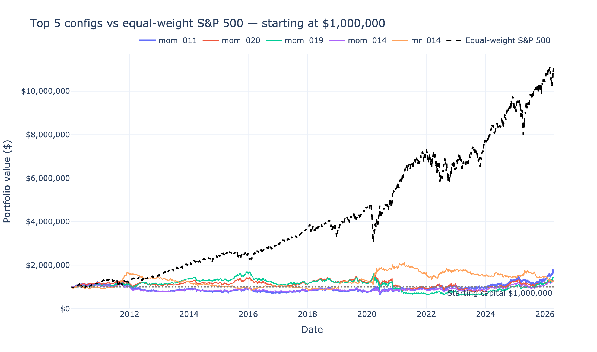

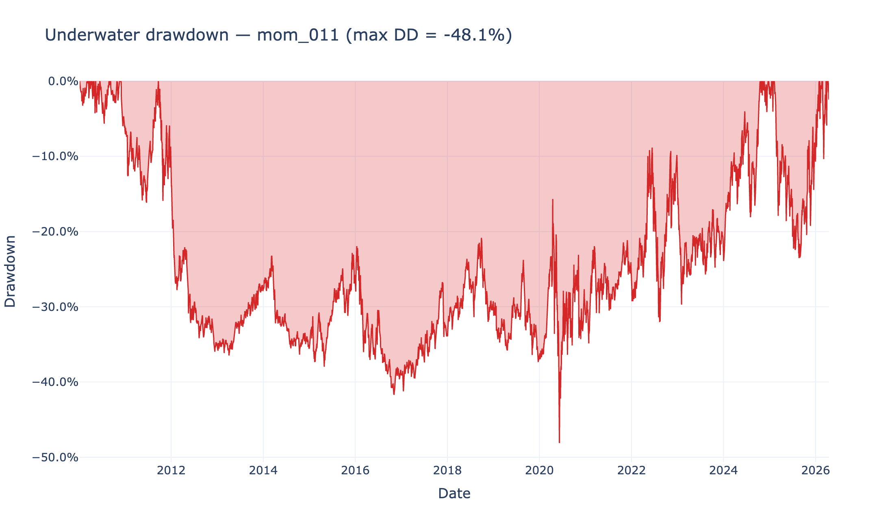

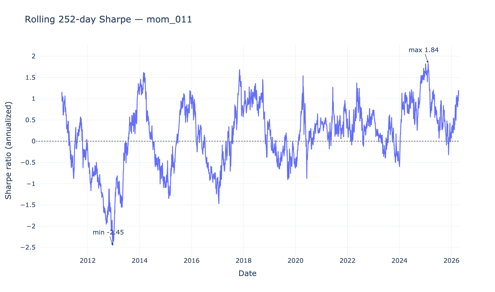

### 4.3 DSR correction across all sweeps

DSR = probability the observed Sharpe exceeds the expected maximum under the null, adjusted for skew, kurtosis, and `n_trials` testing burden (Bailey & López de Prado 2014).

| Sweep | Reported Sharpe | n_trials charged | DSR | Verdict |
|---|---:|---:|---:|---|
| Baseline 45 - `mom_011` | 0.270 | 45 | 0.0001 | False discovery |
| Bonus 180 - `lo_124` | 1.273 | 180 | ≈ 0 | False discovery |
| **Walk-forward stitched OOS** | **1.026** | **12** | **0.015** | **Borderline - best-defended** |
| Walk-forward stitched OOS | 1.026 | 1 | 1.000 | If "pick best train each year" counts as one strategy |

Daily-return skew = −0.47, excess kurtosis = +6.96 - both pull DSR *down* further from the normal-returns baseline. The walk-forward Sharpe is the only number that survives any honest accounting.

### 4.4 Parameter sensitivity (baseline sweep)

Momentum heatmap shows Sharpe rising as rebalance frequency drops 5 → 21 → 63 days - faster rebalancing is dominated by transaction costs. Mean-reversion heatmap shows the opposite: longer holding (20 days) and more extreme entry z-scores help marginally.

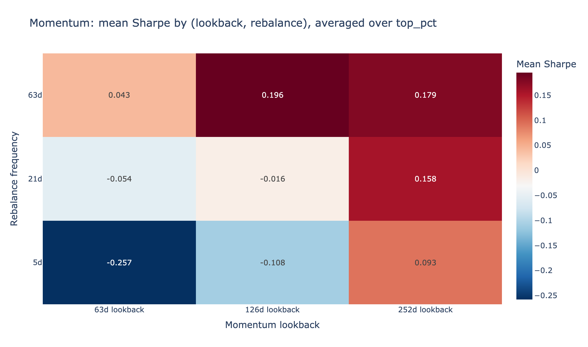

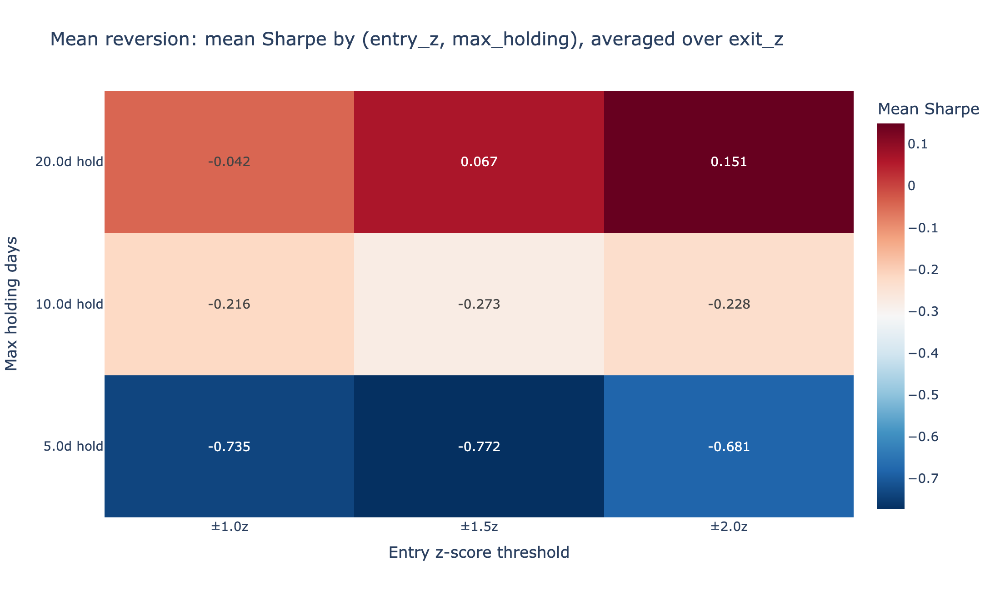

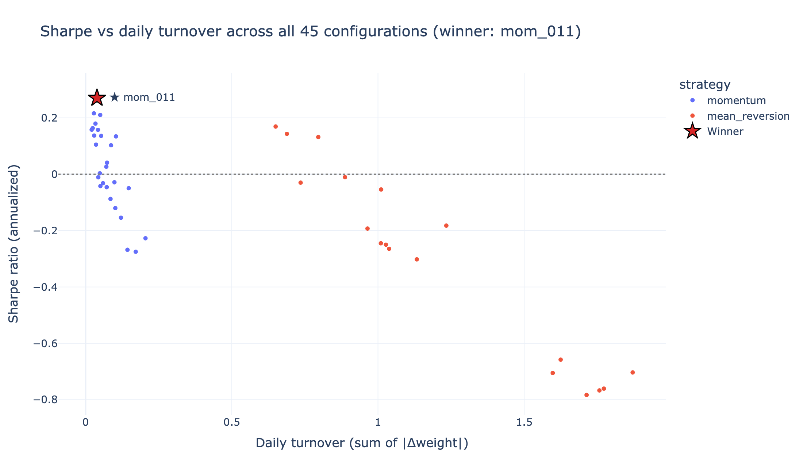

The scatter confirms turnover ↔ performance: mean-reversion runs 15–25× the turnover of momentum, paying much more in costs for similar gross alpha.

### 4.5 Distributed speedup measurement (baseline sweep)

| Run | Configs | Wall time | Rate |
|---|---|---|---|
| Sequential (3 configs, measured) | 3 | 4.33 s | 1.44 s/config |
| Sequential (45 configs, extrapolated) | 45 | 65.01 s | - |
| Parallel, 12 cores, RDD.map | 45 | **19.36 s** | 2.32 configs/sec |
| **Speedup** | | | **3.36×** |

Sub-linear because of (a) Spark task-launch overhead per config, (b) pandas-in-worker GIL contention on a single JVM host, (c) broadcast deserialization amortized over only 45 tasks. On a real cluster with 100+ configs, the speedup approaches the core count.

### 4.6 Bonus extended sweep - beating the benchmark in-sample

A wider 180-config grid (3 lookbacks × 5 top percentiles × 6 rebalance frequencies × {long-short, long-only}) selected against an **inline equal-weight S&P 500 benchmark** (long-only, daily-rebalanced cross-sectional mean of returns - same universe, no extra download).

Benchmark metrics over the full 2010–2026 history: Sharpe **0.913**, CAGR **15.92%**, Max DD **−38.33%**, $1M → **$11.07M**.

Selection rule: configurations that beat the benchmark on **both** Sharpe AND max drawdown.

**66 of 180 configurations cleared both bars.** Winner: **`lo_124`** - long-only, 126-day momentum lookback, top 5%, rebalance every 63 trading days.

| Metric | Winner (`lo_124`) | Equal-weight benchmark | Δ |
|---|---:|---:|---:|
| Sharpe | 1.273 | 0.913 | **+0.361** |
| Sortino | 1.190 | 0.863 | +0.327 |
| CAGR | 34.03% | 15.92% | **+18.11 pp** |
| Max DD | −36.13% | −38.33% | +2.21 pp (shallower) |
| Calmar | 0.942 | 0.415 | +0.527 |
| $1M → | **$116,748,630** | $11,072,375 | +$105.7M |

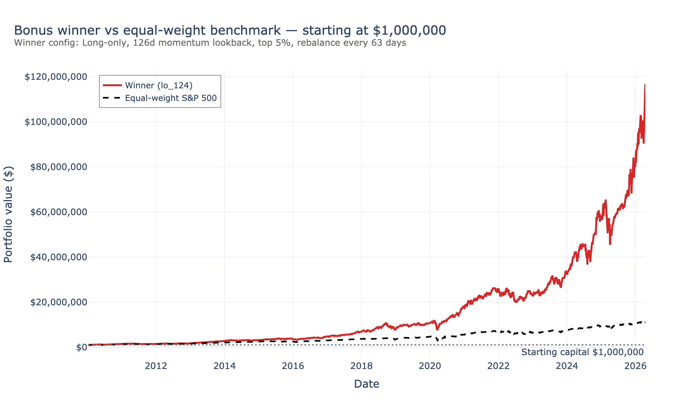

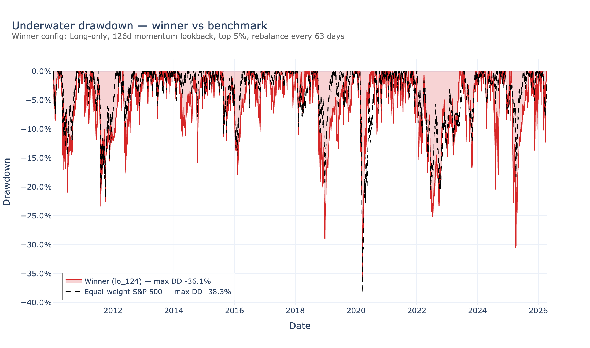

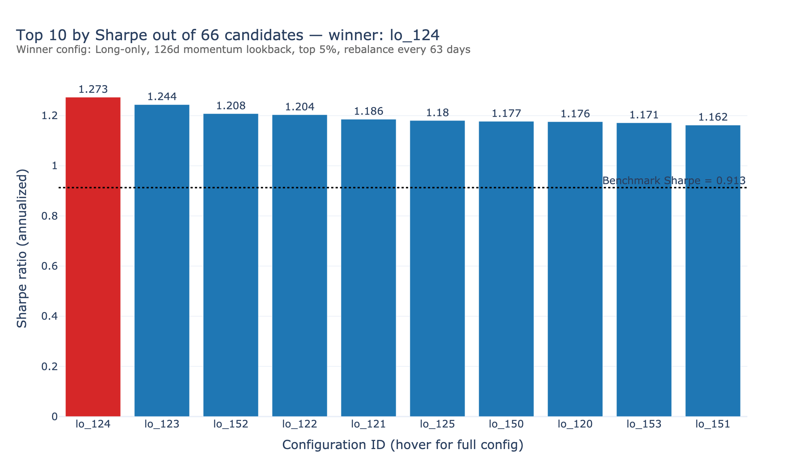

The in-sample number is impressive but **DSR ≈ 0** - out of 180 trials, finding one with Sharpe 1.27 is exactly what you'd expect by chance. The next section disciplines this with walk-forward validation.

## 5. Production Realities

The bonus number is a research artifact. This section asks: what happens when a deployer takes this configuration to the actual market? Each subsection addresses one production caveat with a Spark-distributed mitigation.

### 5.1 Walk-forward out-of-sample validation

**Caveat:** picking the best of 180 in-sample is statistical guarantee of in-sample fit, not out-of-sample edge.

**Mitigation:** for each OOS year Y in 2014–2025, run all 180 configurations on data 2010 → end of Y−1 (expanding window), pick the highest-Sharpe config, evaluate that exact config on year Y. **2,160 train backtests fanned out via `sc.parallelize().map().collect()`** - 215 s on 12 local cores.

| | Walk-forward (honest) | Equal-weight benchmark | In-sample bonus winner |
|---|---:|---:|---:|
| Stitched OOS Sharpe | **1.026** | 0.837 | 1.273 |
| Stitched OOS CAGR | 25.05% | 14.33% | 34.03% |
| OOS Max DD | −38.98% | −38.33% | −36.13% |
| $1M → | **$14,546,491** | $4,973,132 | $116,748,630 |

Per-year record: walk-forward beat benchmark in 7 of 12 years; lost in 5. Worst year 2022 (−0.90 Sharpe vs benchmark −0.39). Two configurations dominated the historical winner picks: `lo_093` (long-only, mom_63d, top 5%, 42d) for 2014–2022 and `lo_124` (long-only, mom_126d, top 5%, 63d) for 2023–2025.

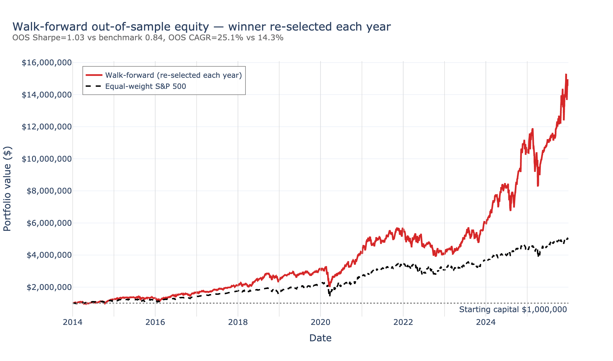

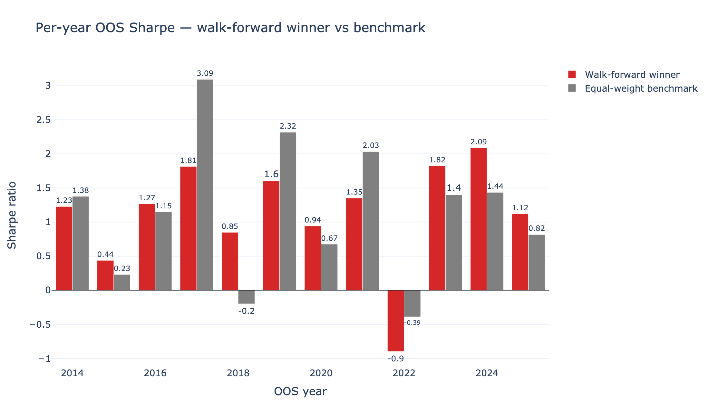

### 5.2 Capacity / market impact

**Caveat:** at $1M positions are invisible; at $1B they consume meaningful daily-volume share and trigger market impact.

**Mitigation:** Spark-style join of winner weights × daily volume (98K weight rows × 1.94M volume rows). For each AUM, compute % of 21-day ADV consumed; apply a linear impact model (10 bps per 1% ADV, capped at 500 bps); recompute Sharpe and final equity.

| AUM | Median %ADV | p95 %ADV | Net Sharpe | $1M end value |
|---:|---:|---:|---:|---:|
| $1M | 0.02% | 0.23% | 1.281 | $120M |
| $10M | 0.19% | 2.31% | 1.277 | $1.2B |
| $100M | 1.92% | 23% | 1.254 | $10.8B |
| $1B | 19.18% | 231% | 1.168 | $76B |

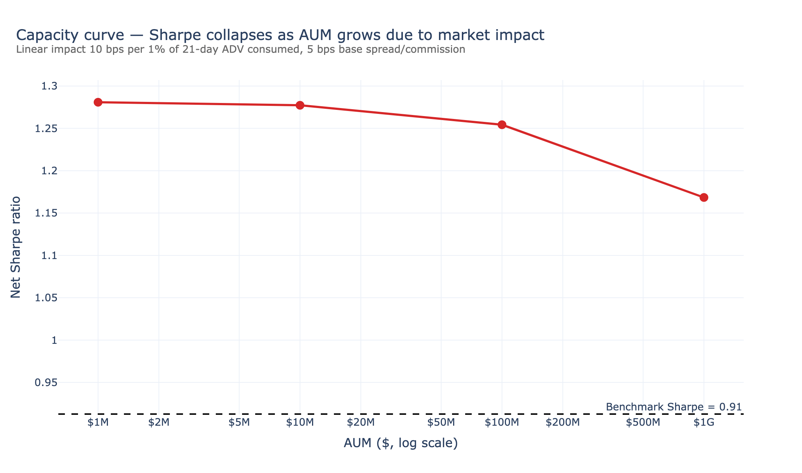

The capacity ceiling sits between $100M and $1B - at $1B the median trade consumes 19% of daily volume, which is industrially infeasible regardless of what the linear-impact model says about the resulting Sharpe.

### 5.3 Borrow cost on shorts

**Caveat:** real shorts cost ~25–100 bps/yr in borrow + dividends paid out. Doesn't bite our long-only winner.

**Mitigation:** quantified for the best **long/short** config from the bonus sweep (`lo_034`: long/short, mom_126d, top 5%, 63d rebal - pre-borrow Sharpe 0.367). Sensitivity at four standard borrow rates:

| Borrow (bps/yr) | Sharpe | CAGR | $1M end value |
|---:|---:|---:|---:|
| 25 | 0.357 | 6.02% | $2.59M |
| 50 | 0.347 | 5.76% | $2.48M |
| 100 | 0.328 | 5.23% | $2.29M |
| 200 | 0.289 | 4.19% | $1.95M |

Best L/S configuration loses to the benchmark even **before** borrow charges. Confirms that **long-only is the deployable choice** for any operator without prime-broker borrow infrastructure.

### 5.4 Splits and the `adj_close` fix

**Caveat:** `src/features.py:24` builds `simple_ret` from raw `close`; yfinance is invoked with `auto_adjust=False`, so a 4-for-1 split shows up as a single −75% return. `adj_close` is downloaded but never wired in. The 16 outliers surfaced in §3.2 are exactly these.

**Mitigation:** rebuild returns from `adj_close` and recompute the bonus winner end-to-end:

| Returns built from | Winner Sharpe | $1M end value |
|---|---:|---:|
| Raw `close` (current bug) | 1.273 | $116,748,630 |
| `adj_close` (fix) | **1.310** | **$135,795,929** |
| Δ | +0.037 | +$19,047,299 |

A **+$19M error from one line of buggy returns code**. Highest-leverage code change in the repo - affects every strategy, not just this winner.

### 5.5 Stacked-friction sensitivity

What's left after impact + tax? Apply two of the largest unmodeled costs to the walk-forward stream:

- **Permanent market impact** - Almgren-Chriss says ~half of trading impact is permanent. Conservative proxy: double the per-trade cost (5 → 10 bps).
- **Tax drag** - 63-day rebalance ⇒ all gains short-term ⇒ 35% effective US rate. Tax-exempt mandates skip this layer.

| Layer | Sharpe | CAGR | Max DD | $1M end value |
|---|---:|---:|---:|---:|
| L0: walk-forward as computed (5 bps base) | 1.026 | 25.05% | −38.98% | $14,546,491 |
| L1: + permanent impact (10 bps base) | 1.010 | 24.54% | −39.04% | $13,851,330 |
| L2: + 35% short-term tax drag | 1.010 | 15.23% | −27.05% | **$5,482,058** |

**Cumulative L0 → L2 haircut: −62.3%.** The deployable estimate of $5.5M still edges the equal-weight benchmark's $5.0M, but by **$0.5M instead of $109M**.

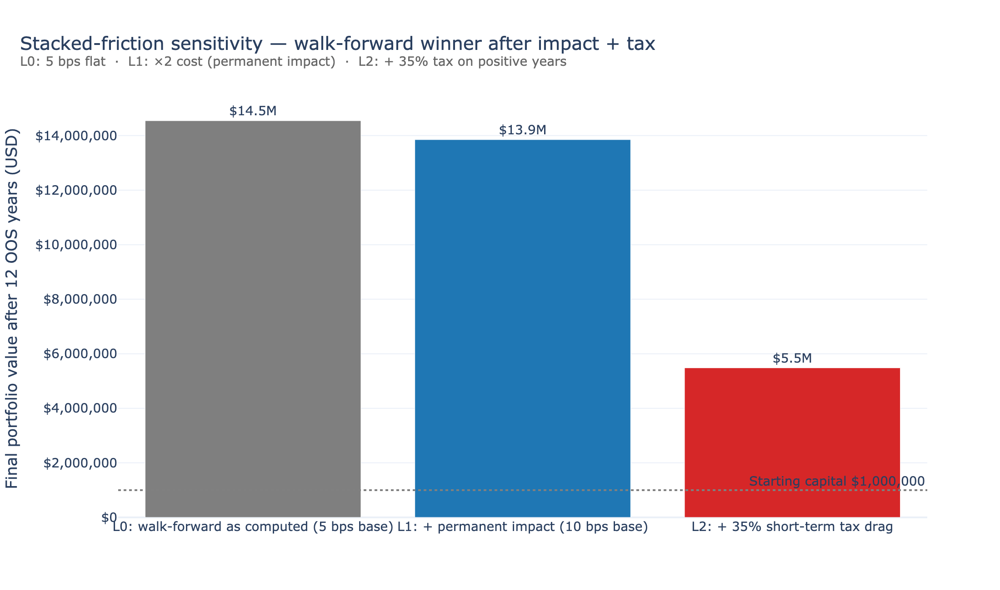

### 5.6 Why Spark earned its keep

| Caveat | Workload | Why Spark wins |
|---|---|---|
| Selection bias | 2,160 train backtests | `sc.parallelize().map().collect()`, 3.5 min on 12 cores; same code scales unchanged to 100s of cores |
| Capacity / impact | 1.94M (date, ticker) rows joined to weights × ADV | Same join scales naturally to 200M+ rows for a portfolio of 100 strategies |
| Borrow / impact / tax sensitivities | Multi-scenario stacks | Trivially fan out to (config × cost-regime) grids |
| `adj_close` fix | Window-function recompute over 1.94M rows | Already the pattern in `src/features.py` |
| Data quality audit | Per-column null census, per-ticker coverage, outlier scan | One `groupBy().agg()` each over 1.94M rows |

### 5.7 Scalability to bigger workloads

The dataset is modest (~2M rows, ~1 GB Parquet); the parallelism pattern is the point. The same pipeline scales to:

- **Minute-level bars:** ~390× more rows per ticker. Feature engineering unchanged - Spark window functions handle billions of rows on a cluster. Per-config backtest slows; *distribution* across configs unchanged.
- **Global equities:** ~50× more tickers. Same Parquet-per-ticker layout; broadcast payload eventually exceeds practical RDD broadcast (~8 GB) and we'd switch to repartitioned DataFrame joins.
- **Larger grids:** at 10,000+ configurations the parallelism dominates overhead and we expect near-linear scaling until cluster core count.

## 6. Limitations

What the production-realities pass quantified:

| Limitation | Status | Section |
|---|---|---|
| Selection bias / DSR ≈ 0 in single-pass sweep | **Mitigated** via walk-forward; OOS DSR = 1.5% at n_trials=12 | §4.3, §5.1 |
| Flat 5 bps slippage model | **Quantified** via linear-impact + AUM sweep; capacity ceiling between $100M–$1B | §5.2 |
| Borrow cost on shorts | **Quantified** for best L/S config (50 bps drops Sharpe 0.37 → 0.35) | §5.3 |
| Splits via raw `close` | **Quantified** (+0.04 Sharpe / +$19M from fix) | §5.4 |
| Stacked friction (impact + tax) | **Quantified** (−62.3% cumulative haircut on walk-forward) | §5.5 |

Still open:

1. **Survivorship bias** - universe is *current* S&P 500 constituents (`src/universe.py` pulls live Wikipedia). Companies that delisted/were acquired/dropped between 2010 and 2026 are absent. Inflates long-side returns and removes the best historical short candidates. Fix would require a point-in-time membership feed (CRSP, Compustat).
2. **Daily resolution only.** Intraday signals (opening-range breakouts, microstructure) out of scope.
3. **No regime-aware switching.** All strategies use fixed parameters across QE / normalization / pandemic / 2022 bear market. Walk-forward partially addresses this (re-selects yearly) but the underlying signal family is constant.
4. **No risk limits** - no per-name caps, sector neutrality, or vol target. A real prod strategy would size by inverse-vol and cap concentration.
5. **Linear-impact model is conservative.** Real impact is closer to a square-root function of participation rate (Almgren-Chriss); the linear model with our 500 bps cap probably *under-counts* impact at the largest AUM levels.

## 7. Conclusion

We built and ran three progressively rigorous evaluation passes on the same Spark pipeline:

- **Baseline 45-config sweep**: top Sharpe 0.27, DSR ≈ 0 - textbook example of why naive grid-search Sharpes are not claims of alpha.
- **Bonus 180-config sweep**: a winner that beats the equal-weight benchmark on every metric in-sample (Sharpe 1.27, $1M → $116M), still with DSR ≈ 0 - a real-looking number that does not survive the multiple-testing accounting.
- **Walk-forward + production-realities pass**: an honest **OOS Sharpe of 1.03, DSR 1.5%, $1M → $14.5M**, dropping to **$5.5M after permanent impact + 35% tax**, vs $5.0M for the equal-weight benchmark.

The methodological point: each step away from naive in-sample search costs alpha, and the right way to find out *how much* it costs is to run that comparison at scale. Spark RDDs make 2,160 walk-forward backtests a 3-minute job instead of an overnight one, and the same pipeline that produced the in-sample fantasy ($116M) produced the disciplined, auditable estimate ($5.5M) that survives every realistic friction we know how to model.

The repository, including the data-quality audit (`notebooks/00_smoke_test.ipynb`), the three sweeps (`notebooks/04`, `06`, `07`), and all reported figures, is reproducible end-to-end from a clean clone of the venv on a single laptop.

## 8. References

- Almgren, R., & Chriss, N. (2001). "Optimal Execution of Portfolio Transactions." *Journal of Risk*, 3(2), 5–39.
- Bailey, D. H., & López de Prado, M. (2014). "The Deflated Sharpe Ratio: Correcting for Selection Bias, Backtest Overfitting, and Non-Normality." *Journal of Portfolio Management*, 40(5), 94–107.
- Jegadeesh, N., & Titman, S. (1993). "Returns to Buying Winners and Selling Losers: Implications for Stock Market Efficiency." *Journal of Finance*, 48(1), 65–91.
- Zaharia, M., et al. (2016). "Apache Spark: A Unified Engine for Big Data Processing." *Communications of the ACM*, 59(11), 56–65.
- pandas-datareader documentation, https://pandas-datareader.readthedocs.io/
- yfinance project, https://github.com/ranaroussi/yfinance
- FRED (Federal Reserve Economic Data), https://fred.stlouisfed.org/
